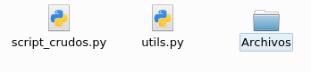
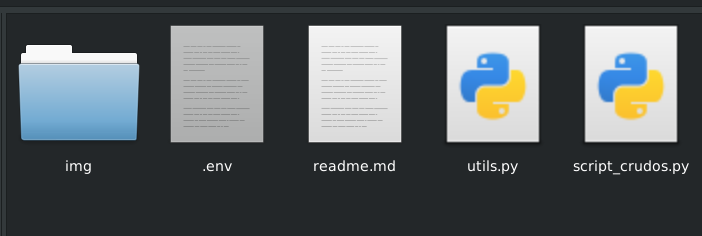
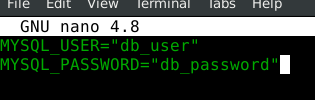
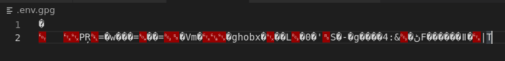
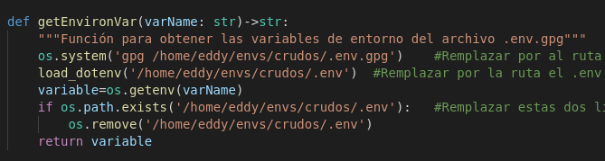

# Dependencias necesarias

+ Python versión 3.X
+ Módulo utils.py 
+ Módulos que probablemente no esten instalados: mysql.connector, dotenv, requests.
+ Otros módulos que comunmente estan incluidos en python: os, json, datetime...

---
# Antes de inicar

## Estructura
Lo primero que tiene que hacer antes de ejecutar el script, es asgurarse de que los archivos script_crudos.py y utils.py están posicionados en el mismo directorio, además de que tiene que existir una carpeta llamada "Archivos", que es en donde estarán todos los archivos a procesar por el script



Este script por seguridad no tiene variables con información sensible como contraseñas declaradas dentro del código, en su lugar utilzia el módulo ***dotenv*** para cargar variables de entorno de un archivo encriptado que se debe de crear para utilizarlas dentro del script.

## Creación de archivo con variables sensibles
1. El primer paso para es crear un archivo .env en cualquier capeta que usted decida, puede estar incluso en el mismo directorio que el script.



2. Dentro de este archivo .env puede declarar las variables que usted necesite para la ejecución del script como en el siguiente ejemplo:



3. Una vez que haya definido las variables que necesite, se deberá encritpar el archivo con el comando " *gpg -c .env* " (Nota: suponiendo que esta en la misma carpeta que el archivo .env, si no deberá definir la ruta hacía este), una vez ejecutado el comando le pedirá que añada una frase de seguridad/contraseña al archivo, recuerde bien esta contraseña ya que servira para acceder a este y **NO** existe forma de recuperar la contraseña. 

4. Después de esto se creará un archivo .gpg con la información encriptada como se muestra en la imagen, **el archivo .env que creó con las variables deberá borrarse** y únicamente se quedará el archivo .env.gpg.



## Modificación del archivo .env.gpg

Si quiere manipular el archivo encriptado para agregar, eliminar o modificar variables tiene que realizarse el siguiente proceso.

1. Dentro de la carpeta con el archivo .gpg se tiene que ejecutar el comando " *gpg .env.gpg* " y proporcionará la contraseña de este, esto generará de nuevo el archivo .env con el texto plano para ser editado (Nota: si existe un archivo .env dentro del directorio deberá sobrescribirlo).
Nota: como paso opcional puede borrar el archivo .gpg una vez que sea desencriptado, si no el comando gpg lo sobrescribirá mas adelante.

2. Edite el documento .env con los cambios que requiera y guardelo.

3. Vuelva a ejecutar el comando para encriptar el archivo (*gpg -c .env*), le pedirá que introduzca una contraseña para encriptar el archivo (puede ser la misma con la que ha estado trabajando el archivo anterior o puede ser una nueva), si existe un archivo .env.gpg tendrá que sobrescribirlo.

4. Borre el archivo .env de la carpeta.

## Funcionamiento del encriptado de las variables.

Para obtener una variable de entorno se necesia llamar a la función getEnvironVar del módulo utils:



Si quiere obtener una variable de entorno deberá llamar la función pasandole el nombre de la variable que esta declarada dentro del archivo .env. 
Por ejemplo, si quiere obtener el valor de la variable MYSQL_USER de la imagen de abajo, deberá llamara a la función getEnvironVar('MYSQL_USER') y le dará de retorno el valor de "db_user"


El proceso para obtener el valor es el siguiente:

1. Se ejecuta el comando gpg de bash para desencriptar el archivo con las variables de entorno, esto lo hace con la función system del módulo os. Cuando se ejecute este paso probablemente le pida que ingrese una contraseña, escriba la contraseña con la que encriptó el archivo, si vuelve a utilziarse la función dentro de la misma ejecución del script ya no le pedirá la contraseña.
2. La función load_env necesitará la ruta con el arcihvo .env que generó el comando gpg para desencriptar el archivo, con esto cargará las variables de entorno dentro de el.
3. Se guarda el valor de variable de entorno que le pasamos por parámetro con la función getenv.
4. Comprueba la existencia del archivo .env, si existe lo borrá por seguridad.
5. Retorna el valor que se guardo de la variable de entorno.

---


# Variables globales

La variable root se utiliza para almacenar la ruta absoluta de donde esta el script, además de eso existen 2 tipos de variables mas: buenos,malos y warning son variables que guardan los nombres de los archivos según su calsificasión, y buen, mal y war son variables contadoras que contarán la cantidad de archivos procesados según su tipo, estas variables se utilziarán a lo largo del script para los archivos del log. 

# Función main

Al inicio de la función hace unas pequeñas pre-configuraciones: crea el objeto argparse por si el script necesita agergar opciones a la hora de ejecutar de scripts (Nota: actualmente el script no necesita que le pasen parámetros para su ejecución), seguido de eso prepara un archivo de logs llamado app.log que se encontrará dentro del mismo directorio del script y anotará la hora de inicio de ejecución.

Después viene la declaración de la variable global root y de user y password, las cuáles son las credenciales para entrar a la base de datos.

Para mas velocidad de procesamiento de archivos se utilizará la llamada a la función crudosWireless en forma de lista comprimida;:
```
[crudosWireless(file,user,password) for file in os.listdir(os.path.join(root,'Archivos')) if file.endswith('_wireless.txt') or file.endswith('_wifi.txt')]

```
La función solo leerá los archivos que se encuentran en la subcarpeta 'Archivos' del directorio del script, solo si terminan con '_wireless.txt' o '_wifi.txt'.

Después de haber leído los arcivos correspondientes, el script anota los archivos y su clasificación dentro del log junto con la hora de finalización y termina la ejecución del script.

***Nota: Normalmente cuando se termina de ejecutar el script manda a llamar a una función para enviar un mensaje a un canal de Slack, pero esta función no sirve dentro del servidor, solo en máquinas locales.***

# Función crudosWireless

Dentro de esta función lo primero que se puede encontrar son las variables globales, las cuales se van a utilizar para guardar los datos del log.
Esta función está conformada casi por completo por un bloque try-except

## Dentro del try


**Pre-proceso**

Empezamos con una región pre-proceso que hace las siguientes acciones:
Primero toma el archivo y su información la carga a una variable con el método json.load y aprovecha para guardar la mac id del sensor tomando el valor de la propiedad 'serial_number'.

Después sigue la conexión a la base de datos con las credenciales para ingresar, se crea un cursor para verificar si la conexión fue establecida correctamente, si hay algún error, es posible que las credenciales sean incorrectas, por lo que se detendrá la ejecución del script en ese punto mostrando el error y enviando un mensaje a los logs con lo sucedido.

Después manda a llamar al stored procedure para crear un nodo con la mac id del archivo, si ya existe un registro con esa id no pasará nada, ya que hay un insert ignore en el stored procedure. Dentro de la base, las zonas están ligadas a un sensor por su id, para generar los crudos necesitamos el nombre de la zona en la que está el sensor, para esto se utiliza otro stored procedure para obtener el nombre de la zona, mienrtas que los registros de los nodos se crean de manera automática los registros de las zonas no, por lo que puede que no exista una zona creada en la base de datos para un nodo o puede que si. 

El nombre de la zona se guarda en la variable zona, con un if preguntamos si el valor de esta variable es None (o sea, que no existe la zona para el nodo), si es así, tomamos el arcihvo como warning y escribimos en los logs que no existe la zona para el nodo y se termina la ejecución de la función, pero si la variable zona contiene un valor, entonces sigue con el proceso.


**Proceso crudos**

Para extraer los datos que van a generar los crudos se iterará sobre los registros la propiedad 'records'.
Lo primero que hace es tomar la hora de la propiedad 'from' y la guarda en una variable, aquí la fecha puede ser un timestap de unix o una fecha normal, para comprobar de que tipo es, toma el tipo de dato de la variable con la fecha y la compara con un tipo de dato int dentro de un if, si son iguales (la fecha es un int) significa que la fecha es un timestamp y convierte la fecha con fromtimestamp, en caso contrario la fecha se convertirá con un parse.

Dentro de 'records' existe otra propiedad sobre la cuál támbien vamos a iterar la cual es 'devices'
Pueden existir 2 tipos de id según su longitud, si tiene 12 caracteres de longitud se le va a dar un formato especial, si no el id se toma directamente de la propiedad 'id' y en ambos casos se convertirá el id a un valor decimal que será guardado en una variable.
Seguido de eso calcula la potencia del dispositivo, calcula la distancia y el procentaje potencia.
Estos datos se guardan en un diccionario, de este diccionario creamos un dataframe y con el agregamos la información al csv que se creó antes.

Si no se produjó ningún error durante este proceso, el archivo es tomado como bueno, su información se agrega al registro de logs y se mueve a una carpeta llamada 'Buenos_wireless' y termina con la ejecución de la función.

## Dentro del except

Si por alguna razón hay un error durante la lectura de los datos, se tomará la información del archivo leído para los logs y del error producido para ser enviado a los logs y el archivo se mueve una carpeta llamada 'Malos_wireless' y termina la ejecución de la función.